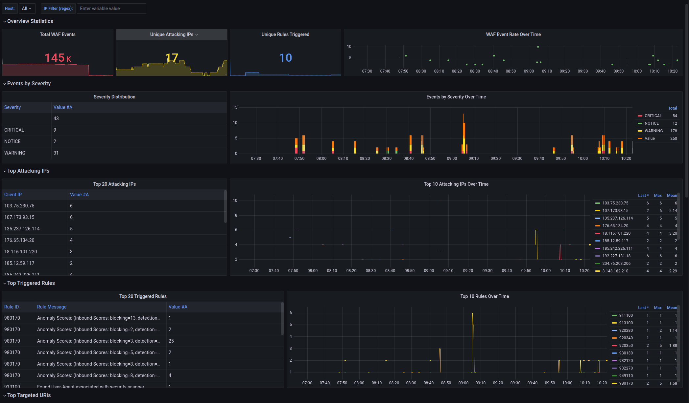

# NS-Security

Open-source NetSapiens security platform — audit tools and hardening automation.

## Disclaimer

**This software is provided "as-is" without warranty of any kind, express or implied.** The authors and contributors accept no responsibility or liability for any damage, data loss, service disruption, or security incidents arising from the use of these tools. They represent a best effort to establish a baseline of security assurance for NetSapiens environments and may not work correctly in all configurations or scenarios. Always test in a non-production environment first and review all changes before applying to production systems.

## Installation

### Standalone binary (pending)

Download the latest release — no Python or dependencies required:

```bash
wget https://github.com/jsrobinson3/ns-security/releases/latest/download/nssec
chmod +x nssec
sudo mv nssec /usr/local/bin/
```

### Debian package (pending)

```bash
wget https://github.com/jsrobinson3/ns-security/releases/latest/download/nssec_0.1.0_amd64.deb
sudo apt install ./nssec_0.1.0_amd64.deb
```

The `.deb` installs the binary to `/usr/local/bin/nssec` and reference files (rules, dashboards, insight templates) to `/usr/share/nssec/`.

### From source (requires Python 3.10+)

```bash
git clone https://github.com/jsrobinson3/ns-security.git
cd ns-security
sudo apt install python3-venv -y
python3 -m venv .venv
source .venv/bin/activate
pip install --upgrade pip
pip install -e .
```

### Tested On

| OS | NetSapiens Version | Status |
|----|-------------------|--------|
| Ubuntu 24.04 LTS | v44.x | Tested |
| Ubuntu 22.04 LTS | v44.x | Tested |
| Ubuntu 20.04 LTS | v44.x | Source Only |

Other Debian-based distributions may work but are untested. Contributions and test reports for additional platforms are welcome.

> **Ubuntu 20.04 note:** U20 ships with Python 3.8 but nssec requires 3.10+. Install from source is not supported on U20 — use the standalone binary or .deb package instead.

### Requirements

- Root access required for WAF installation and hardening commands

## Quick Start

```bash
# Detect server type
nssec server detect

# Initialize configuration
sudo nssec init

# Run security audit
nssec audit run

# Generate report
nssec audit report --format html
```

## Features

- **Security Audit** — Check your NetSapiens configuration against best practices
- **Server Detection** — Auto-detect Core, NDP, Recording, QoS server types
- **WAF Management** — Install and manage ModSecurity with OWASP CRS, including NetSapiens-specific exclusion rules to prevent false positives
- **Grafana Dashboards** — Pre-built Loki and Prometheus dashboards for API usage, Apache logs, and WAF event monitoring
- **mTLS Support** — Device provisioning security (see Related Projects)
- **Rekey and Resync Devices** — Rekey and sync SIP devices across domains (see Related Projects)

## WAF Management

Install ModSecurity with OWASP CRS and NetSapiens-tuned exclusions:

```bash
# Install in DetectionOnly mode (safe — logs but does not block)
sudo nssec waf init

# Check current WAF status
nssec waf status

# Switch to blocking mode once you've reviewed the logs
sudo nssec waf enable
```

The WAF module includes:
- OWASP CRS v4 with paranoia level 1 (low false positive rate)
- NetSapiens exclusion rules for admin UI, ns-api, SiPbx, NqsProxy, portal login, phone provisioning, iNSight health checks, and localhost traffic
- CRS tuning for allowed HTTP methods and content types used by NetSapiens

WAF rule templates (exclusions and CRS setup overrides) are defined in `src/nssec/modules/waf/config.py` and deployed to `/etc/modsecurity/` by `nssec waf init`.

### Path Restrictions (.htaccess)

Restrict access to sensitive NetSapiens paths (admin UI, API, NDP, recording) using `.htaccess` IP allowlists:

```bash
# Show current restriction status
nssec waf restrict show

# Create .htaccess restrictions (interactive — shows existing IPs, asks to keep or overwrite)
sudo nssec waf restrict init

# Specify IPs directly
sudo nssec waf restrict init --ip 1.1.1.1 --ip 1.2.3.0/22

# Add/remove individual IPs
sudo nssec waf restrict add 1.1.1.1
sudo nssec waf restrict remove 1.1.1.1

# Re-deploy after a NetSapiens package upgrade overwrites .htaccess files
sudo nssec waf restrict reapply
```

The `init` command will:
- Detect which paths apply to the current server type (Core, NDP, Recording, Combo)
- Show any existing IPs from current `.htaccess` files and ask whether to keep or overwrite them
- Always include `127.0.0.1` automatically
- Save the IP list to `/etc/nssec/restrict-ips.json` so it survives NS package upgrades

**Protected paths:**

| Target | Path | Server Types |
|--------|------|:------------:|
| SiPbx Admin UI | `/usr/local/NetSapiens/SiPbx/html/SiPbx/` | Core, Combo |
| ns-api | `/usr/local/NetSapiens/SiPbx/html/ns-api/` | Core, Combo |
| NDP Endpoints | `/usr/local/NetSapiens/ndp/` | NDP, Combo |
| LiCf Recording | `/usr/local/NetSapiens/LiCf/html/LiCf/` | Recording, Combo |

### mod_evasive (HTTP Flood Protection)

mod_evasive is managed independently from the WAF and provides application-layer DDoS protection. It has **no detection-only mode** — when enabled it will block IPs that exceed request thresholds (HTTP 403).

```bash
# Check mod_evasive status
nssec waf evasive status

# Enable with standard profile (high thresholds — safe default)
sudo nssec waf evasive enable

# Enable with strict profile (tuned for NetSapiens traffic)
sudo nssec waf evasive enable --profile strict

# Disable
sudo nssec waf evasive disable
```

**Profiles:**
| Profile | DOSPageCount | DOSSiteCount | DOSBlockingPeriod | Use Case |
|---------|:---:|:---:|:---:|------|
| `standard` | 100 req/page/s | 500 req/IP/s | 10s | Safe default — only catches extreme floods |
| `strict` | 15 req/page/s | 60 req/IP/s | 60s | Tuned for NetSapiens traffic patterns |

Start with `standard` and review the Apache API Usage dashboard and mod_evasive block logs before switching to `strict`. Block events are logged to `/var/log/apache2/mod_evasive.log` for Loki/Grafana ingestion.

## Server Types

| Component | Core | NDP | Recording | QoS |
|-----------|:----:|:---:|:---------:|:---:|
| WAF | Yes | Yes | Yes | Yes |
| mTLS Provisioning | — | Yes | — | — |
| MySQL Hardening | Yes | Yes | Yes | Yes |

## iNSight Templates

Pre-built dashboards for import into your iNSight/Grafana instance (`insight/`):

- `api.json` — API v1/v2 request rate monitoring (Prometheus)
- `apacheApiUsage.json` — Apache access log analysis by IP and path (Loki)
- `modsecurityWaf.json` — ModSecurity WAF event analysis: severity, attacking IPs, triggered rules, targeted URIs (Loki)
- `modEvasive.json` — mod_evasive HTTP flood protection: blocked IPs, block rate, repeat offenders (Loki)
- `sshLogin.json` — SSH login monitor: failed/successful logins, brute-force source IPs, targeted usernames (Loki)



## Related Projects

These community projects provide additional NetSapiens security capabilities:

- **[mTLSProtect](https://github.com/OITApps/mTLSProtect)** — Mutual TLS for VoIP phone provisioning. Deploy on NDP servers only.
  - Poly (full mTLS with CN validation)
  - Yealink (full mTLS, Gen 1+)
  - Grandstream (Gen 1 & Gen 2 certs)
  - Panasonic (cert validation only, no CN matching)
  - HTek (not yet supported — contributions welcome)

- **[rekeyandsync](https://github.com/kselkowitz/rekeyandsync)** — Rekey and resync SIP device credentials

- **[ua-monitor](https://github.com/traviscw/ua-monitor)** — SIP Registration Monitor for VoIPMonitor

## Roadmap

- [x] ModSecurity installation and configuration with OWASP CRS
- [x] NetSapiens-specific WAF exclusion rules
- [x] ModSecurity WAF monitoring dashboard
- [x] .htaccess IP restrictions for sensitive paths
- [ ] MySQL password rotation across all NS services
- [ ] Fail2ban SIP plugin for NetSapiens

## License

Apache 2.0 — See [LICENSE](LICENSE) for details.
